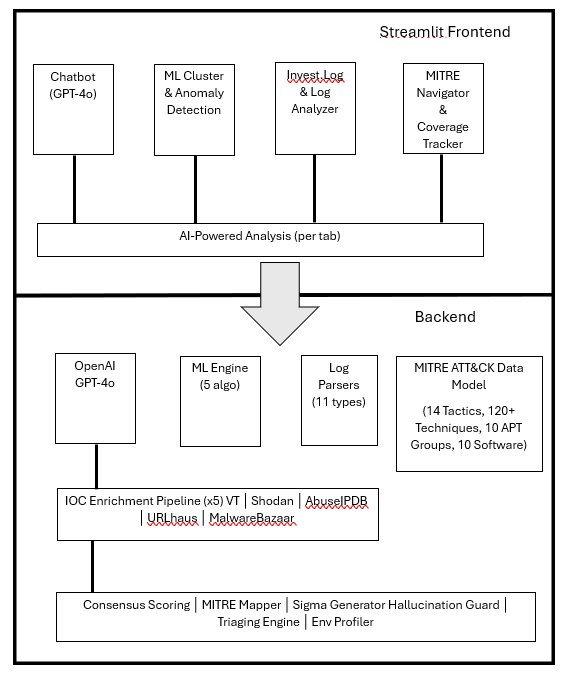

# 🧠 CognitiveHunt — AI-Enhanced Threat Intelligence Platform

An AI-powered threat hunting and IOC analysis platform built with **Streamlit**, **OpenAI GPT-4o**, and **scikit-learn**. Designed for SOC analysts to automate IOC enrichment, detect threat campaigns via unsupervised ML, map adversary behaviors to MITRE ATT&CK, analyze raw security logs, and generate detection rules — all through a conversational interface.

> **Capstone Project** — Automated IOC Enrichment and Threat Intel Visualization  
> Singapore Institute of Technology: University of Applied Learning · 2025–2026

### 🌐 Live Demo

**[https://cognitivehunt-capstone-project-benchm-2102933.streamlit.app/](https://cognitivehunt-capstone-project-benchm-2102933.streamlit.app/)**

---

## ✨ Features

### 💬 AI Chatbot (HuntBot)
| Feature | Description |
|---|---|
| **Conversational Threat Hunting** | GPT-4o powered assistant with a "Senior CTI Analyst" persona |
| **P1–P4 Triaging System** | Structured severity classification with immediate actions, investigation steps, escalation criteria, and containment recommendations |
| **Environment-Aware Responses** | Tailors SIEM queries (SPL, KQL, EQL) and tool recommendations to the analyst's configured security stack |
| **Detection Rule Drafting** | Generates Sigma, YARA, and SIEM-native queries on demand |

### 🔍 IOC Enrichment (5 Sources)
| Source | Intelligence |
|---|---|
| **VirusTotal** | File/IP/domain/URL reputation and detection ratios |
| **Shodan** | Open ports, banners, ASN, vulnerabilities, SSL/JARM fingerprints |
| **AbuseIPDB** | IP abuse reports, confidence scoring, Tor exit node detection |
| **URLhaus** | Malicious URL database (abuse.ch) — no key required |
| **MalwareBazaar** | Malware sample lookup by hash (abuse.ch) — no key required |

### 🤖 Machine Learning (5 Engines)
| Engine | Purpose |
|---|---|
| **K-Means Clustering** | Campaign detection using Shannon Entropy, digit ratio, vowel ratio, subdomain depth |
| **DBSCAN** | Density-based clustering for identifying threat groups without specifying K |
| **Isolation Forest** | Anomaly detection for zero-day and novel threat identification |
| **TF-IDF Cosine Similarity** | IOC correlation based on shared behavioral tags and descriptions |
| **DGA Detector** | Domain Generation Algorithm scoring using entropy + English bigram analysis |

### 🎯 MITRE ATT&CK Integration
| Feature | Description |
|---|---|
| **ATT&CK Matrix Heatmap** | Navigator-style visualization with group coverage overlay |
| **Technique Explorer** | Deep-dive into any technique — sub-techniques, groups, software, mitigations, data sources |
| **Group Analysis** | Radar charts for kill chain coverage, APT group comparison tool |
| **Detection Coverage Tracker** | Track which techniques your SOC detects, visualize gaps per tactic |
| **Relationship Graph** | Interactive network graph of Technique ↔ Group ↔ Software ↔ Mitigation relationships |
| **LLM-Powered Mapping** | GPT-4o maps IOCs to TTPs with reasoning, validated against 400+ local technique IDs |

### 📂 Log File Analysis (11 Log Types)
| Log Type | Format | Key Analysis |
|---|---|---|
| **FortiGate UTM** | Key=value | Web filter, app control, src/dst IP, URL categories |
| **FortiGate Event** | Key=value | System events, DHCP statistics, VPN |
| **IIS Web Server** | W3C space-delimited | HTTP method, URI, status code, user-agent, client IP |
| **Nessus Scan** | JSON | Vulnerability severity, plugin families, affected hosts |
| **HTTP Stream** | JSON | Full HTTP request/response, headers, content |
| **ICMP Stream** | JSON | Ping sweeps, echo request/reply patterns |
| **MAPI Stream** | JSON | Email protocol traffic, attachment indicators |
| **DHCP Stream** | JSON | Lease activity, rogue device detection |
| **Windows Registry** | Multiline KV | Process image, key path, registry operations |
| **WinEventLog Application** | Multiline KV | Application events, source names, event codes |
| **WinEventLog System** | Multiline KV | Service installations, SCM events, system errors |

Log analysis includes: auto-detection, IOC extraction, 44 MITRE ATT&CK detection rules, timeline visualization with spike detection, top-talker analysis, and ML anomaly detection.

### 🤖 AI-Powered Analysis (All Pages)
Every analysis page includes a **"🧠 Ask AI to analyze"** button that sends the results to GPT-4o for deeper insights. Users can then ask follow-up questions in a dedicated chat interface per tab.

### 📝 Additional Capabilities
| Feature | Description |
|---|---|
| **Sigma Rule Generator** | Auto-generates valid .yml detection rules for IPs, domains, and file hashes |
| **Consensus Scoring** | Weighted multi-source voting algorithm (5 sources) for IOC risk assessment |
| **API Source Toggles** | Enable/disable individual enrichment APIs from the sidebar |
| **Environment Profiler** | Configure SIEM, EDR, firewall, cloud, OS, log sources, compliance frameworks |
| **Investigation Log** | Full session history with search, JSON/CSV export for audit trails |
| **IOC Export** | Extract and export IOCs from uploaded logs as JSON |

---

## 🚀 Getting Started

### Prerequisites

- Python 3.10 or higher
- An OpenAI API key — [get one here](https://platform.openai.com/api-keys) (required for chatbot and MITRE mapping)
- Optional: VirusTotal, Shodan, AbuseIPDB API keys (for IOC enrichment)

---

## Option 1: Run from Streamlit Community Cloud (Recommended — Free)

This is the easiest way. No local installation required.

### Step 1: Create a Free Streamlit Account

1. Go to [**share.streamlit.io**](https://share.streamlit.io)
2. Click **"Sign up"** or **"Continue with GitHub"**
3. Authorize Streamlit to access your GitHub account
4. You now have a free Streamlit Community Cloud account

### Step 2: Fork or Clone the Repository

1. Go to [**github.com/BenjaminChiam/CapStone-Project**](https://github.com/BenjaminChiam/CapStone-Project)
2. Click the **"Fork"** button (top-right) to copy it to your own GitHub account
3. Alternatively, download the ZIP and create your own repository:
   - Click **"Code" → "Download ZIP"**
   - Extract the files
   - Create a new GitHub repo and upload all the files to it

### Step 3: Deploy on Streamlit Cloud

1. Go to [**share.streamlit.io**](https://share.streamlit.io) and sign in
2. Click **"New app"**
3. Select your forked/created repository
4. Set the following:
   - **Repository:** your-username/CapStone-Project (or your repo name)
   - **Branch:** main
   - **Main file path:** app.py
5. Click **"Advanced settings"** and paste your API keys in the **Secrets** box:

```toml
OPENAI_API_KEY = "sk-your-openai-key-here"
VIRUSTOTAL_API_KEY = "your-virustotal-key-here"
SHODAN_API_KEY = "your-shodan-key-here"
ABUSEIPDB_API_KEY = "your-abuseipdb-key-here"
```

6. Click **"Save"**, then click **"Deploy"**
7. Wait 3–5 minutes for the initial build (dependencies are cached for subsequent deploys)
8. Your app will be live at `https://your-app-name.streamlit.app`

> **Note:** URLhaus and MalwareBazaar do not require API keys — they work out of the box.

---

## Option 2: Run Locally on Your Computer

### Step 1: Download the Project

**From GitHub:**
```bash
git clone https://github.com/BenjaminChiam/CapStone-Project.git
cd CapStone-Project
```

**Or from ZIP download:**
1. Download the ZIP from the GitHub repository
2. Extract it to a folder (e.g., `C:\Users\YourName\CapStone-Project`)
3. Open a terminal/command prompt and navigate to that folder:
```bash
cd path/to/CapStone-Project
```

### Step 2: Set Up Python Environment

```bash
# Create a virtual environment
python -m venv venv

# Activate it
# Windows:
venv\Scripts\activate
# macOS / Linux:
source venv/bin/activate

# Install dependencies
pip install -r requirements.txt
```

### Step 3: Configure API Keys

```bash
# Copy the example environment file
cp .env.example .env
```

Open `.env` in a text editor and fill in your API keys:
```
OPENAI_API_KEY=sk-your-openai-key-here
VIRUSTOTAL_API_KEY=your-virustotal-key-here
SHODAN_API_KEY=your-shodan-key-here
ABUSEIPDB_API_KEY=your-abuseipdb-key-here
```

### Step 4: Run the App

```bash
streamlit run app.py
```

The app will automatically open in your browser at `http://localhost:8501`.

> **Tip:** If you get `streamlit is not recognized`, try: `python -m streamlit run app.py`

---

## Option 3: Deploy with Docker (Advanced)

For users who want to containerize the application or deploy it on a server.

### Step 1: Install Docker

- **Windows / macOS:** Download [Docker Desktop](https://www.docker.com/products/docker-desktop/)
- **Linux:** Install via your package manager (e.g., `sudo apt install docker.io`)

### Step 2: Download the Project

```bash
git clone https://github.com/BenjaminChiam/CapStone-Project.git
cd CapStone-Project
```

### Step 3: Create a `.env` File

```bash
cp .env.example .env
# Edit .env with your API keys
```

### Step 4: Build the Docker Image

```bash
docker build -t cognitivehunt .
```

### Step 5: Run the Container

```bash
docker run -p 8501:8501 --env-file .env cognitivehunt
```

The app will be available at `http://localhost:8501`.

### Step 6: Deploy to a Cloud Server (Optional)

To deploy on a cloud VM (e.g., AWS EC2, Azure VM, DigitalOcean):

1. SSH into your server
2. Install Docker: `sudo apt update && sudo apt install docker.io`
3. Clone the repo: `git clone https://github.com/BenjaminChiam/CapStone-Project.git`
4. Build and run:
```bash
cd CapStone-Project
docker build -t cognitivehunt .
docker run -d -p 8501:8501 --env-file .env --restart unless-stopped cognitivehunt
```
5. Access via `http://your-server-ip:8501`
6. (Optional) Set up a reverse proxy (Nginx) with SSL for HTTPS access

---

## 📁 Project Structure

```
CapStone-Project/
├── app.py                          # Main chatbot interface (CognitiveHunt)
├── pages/
│   ├── 1_Cluster_Analysis.py       # ML clustering, anomaly detection, DGA scanner
│   ├── 2_Investigation_Log.py      # Log upload, analysis, IOC extraction, MITRE mapping
│   ├── 3_Environment_Profile.py    # Corporate environment configuration
│   └── 4_MITRE ATT&CK.py          # ATT&CK Navigator, group analysis, coverage tracker
├── utils/
│   ├── __init__.py
│   ├── ai_chat.py                  # Reusable AI analysis chat component
│   ├── ioc_enrich.py               # 5-source IOC enrichment pipeline
│   ├── log_analyzer.py             # Log parsers, IOC extraction, 44 MITRE detection rules
│   ├── mitre_attack_data.py        # ATT&CK data: 14 tactics, 120+ techniques, 10 APTs, 10 tools
│   ├── mitre_data.py               # Local MITRE technique ID validation dictionary (400+)
│   ├── mitre_mapper.py             # GPT-4o MITRE mapping with hallucination guard
│   ├── ml_engine.py                # 5 ML engines: K-Means, DBSCAN, Isolation Forest, TF-IDF, DGA
│   └── sigma_generator.py          # Sigma rule auto-generation (IP/domain/hash templates)
├── .streamlit/
│   └── config.toml                 # Streamlit theme (SOC dark mode)
├── requirements.txt                # Python dependencies
├── Dockerfile                      # Docker containerization
├── .env.example                    # Template for API keys
├── .gitignore                      # Git ignore rules
└── README.md                       # This file
```

---

## 🧠 Architecture



*Figure 1: CognitiveHunt System Architecture — Streamlit Frontend with four main pages, AI-Powered Analysis layer, and Backend components including GPT-4o, ML Engine, Log Parsers, MITRE ATT&CK Data Model, IOC Enrichment Pipeline, and processing engines.*

---

## 💡 Usage Examples

### Chatbot
- *"Analyze this IP: 185.243.112.55 — is it associated with any known C2 infrastructure?"*
- *"Generate a threat hunting hypothesis for DNS tunneling in our environment"*
- *"Write a Sigma rule to detect Cobalt Strike beacons on port 443"*
- *"What MITRE techniques are associated with APT29?"*
- *"Triage this alert: multiple failed logins from 10.0.0.50 followed by a successful login at 3am"*

### Quick IOC Tools (Sidebar)
1. Paste an IOC → Click **🔍 Enrich** for 5-source analysis
2. Click **🎯 MITRE** for ATT&CK mapping with LLM reasoning + matrix grid view
3. Click **📝 Sigma** to generate and download a detection rule
4. Click **🧬 DGA** for Domain Generation Algorithm analysis
5. Click **🚨 Triage** for structured P1–P4 incident response guidance

### Log Analysis
1. Navigate to **Investigation Log** → **Log File Analysis** tab
2. Upload `.csv`, `.csv.gz`, `.json`, or `.log` files
3. View auto-detected log type, parsed data, and top-talker charts
4. Check **MITRE Mapping** tab for detected adversary techniques with evidence
5. Check **Anomaly Detection** tab for ML-flagged suspicious IPs and DGA domains
6. Export extracted IOCs as JSON for further investigation

### AI-Powered Analysis
After any analysis completes (clustering, DGA scan, MITRE mapping, etc.), click the **"🧠 Ask AI to analyze"** button for GPT-4o insights. You can then ask follow-up questions in the dedicated chat.

---

## 🔐 Security Notes

- **Never commit API keys** — use `.env` locally or Streamlit secrets for cloud deployment
- The MITRE mapper validates all LLM outputs against a local dictionary of 400+ technique IDs to prevent hallucinated technique IDs
- URLhaus and MalwareBazaar enrichment sources require no API keys (free public APIs)
- API sources can be individually enabled/disabled from the sidebar toggles

---

## 📄 License

MIT License — See [LICENSE](LICENSE) for details.

---

## 🙏 Acknowledgments

- [MITRE ATT&CK](https://attack.mitre.org/) — Adversarial Tactics, Techniques, and Common Knowledge framework
- [MITRE ATT&CK Data Model](https://github.com/mitre-attack/attack-data-model) — Schema reference for ATT&CK data structures
- [Streamlit](https://streamlit.io/) — Application framework
- [OpenAI](https://openai.com/) — GPT-4o API for LLM-powered analysis
- [VirusTotal](https://www.virustotal.com/), [Shodan](https://www.shodan.io/), [AbuseIPDB](https://www.abuseipdb.com/) — Threat intelligence APIs
- [abuse.ch](https://abuse.ch/) — URLhaus and MalwareBazaar malware databases
- [Sigma](https://github.com/SigmaHQ/sigma) — Open standard for detection rules
- [Splunk BOTSv1](https://github.com/splunk/botsv1) — Sample log dataset used for testing
